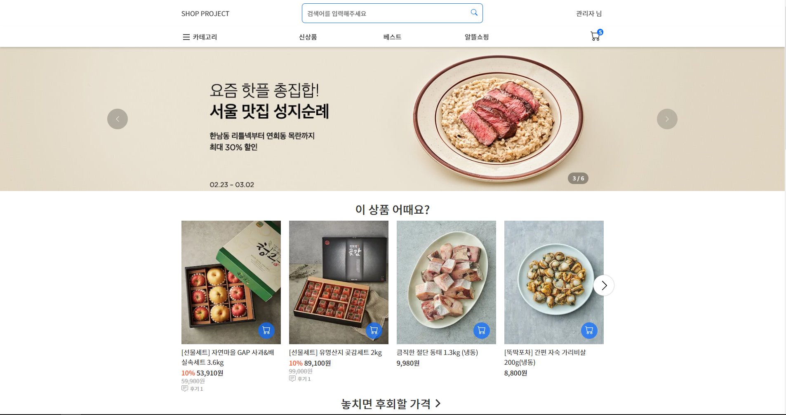
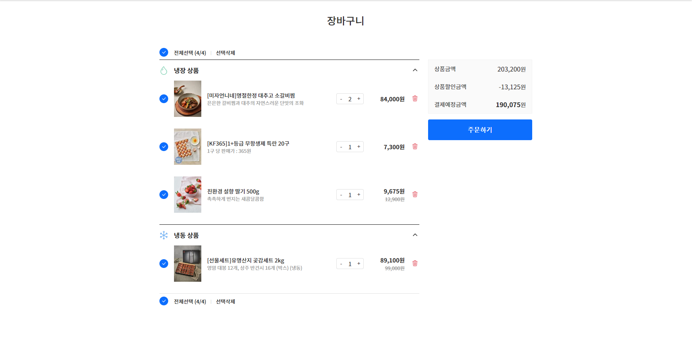

<h1>SHOP-PROJECT</h1>

쇼핑몰 마켓컬리를 기능 축소해서 개발한 클론코딩 프로젝트입니다.
모바일화면은 모바일 기기가 감지되면 특정 UI만 분기별로 렌더링되고
기존의 모바일 마켓컬리 UI와 다르게  기존에 있는 UI(PC 버전)를 활용했습니다.

프론트엔드 - 전오승

백엔드 - 전오승

마켓컬리 - [https://www.kurly.com](https://www.kurly.com)

프로젝트 배포 링크 - [http://tnd10327.cafe24.com](http://tnd10327.cafe24.com)

ERD - [https://www.erdcloud.com/d/GAjjEJSWfjuuRbfYc](https://www.erdcloud.com/d/GAjjEJSWfjuuRbfYc)

<div style="text-align:center">
    <div>
        사용 기슬 스택
    </div>
    <div style="align-items:center">
        
        
        
        
        
        
        
        
        
        
        
        
    </div>
</div>
<div>
    <h2>메인 홈페이지</h2>
    
</div>

메인 홈페이지의 구성은 메인 이미지 슬라이드,추천 상품,추천 컬렉션, 추천 주제, 한정 판매 UI로 구성되어 있습니다.
이미지 슬라이드와 추천 상품은 하나의 UI에 고정되어 따로 추가 불가능합니다.
UI는 추가는 관리자 메뉴의 메인 홈 UI 관리에서 가능합니다

1. [홈페이지](https://github.com/jeonoseung/shop/blob/main/pages/index.tsx)


2. [메인 이미지 슬라이드](https://github.com/jeonoseung/shop/tree/main/src/component/home/image-slider)

    이미지 슬라이드는 이미지가 전환되는 기능만 있고 모바일 UI와 비슷하지만 모바일 UI는 터치 이벤트로 구현해야했기 때문에 분기별로 렌더링되게 했습니다.

3. [추천 상품&컬렉션](https://github.com/jeonoseung/shop/tree/main/src/component/home/recommend)

    추천 상품과 추천 켈렉션 UI는 기능은 거의 비슷하지만 추천 컬렉션에서 전체보기 기능 때문에 따로 나눴습니다.

    추천 상품은 10분마다 상품목록에서 랜덤으로 20개의 데이터를 저장하는 테이블에서 데이터를 가져옵니다.

    추천 컬렉션은 설정된 컬렉션으로 UI를 등록하면 메인 홈페이지에 표시됩니다.

4. [추천 주제](https://github.com/jeonoseung/shop/tree/main/src/component/home/recommend-topic)

    추천 주제는 추천 컬렉션과 비슷하고 설정한 이미지와 내용 + 컬렉션 구성 상품 4개를 표시합니다.    

5. [한정 판매](https://github.com/jeonoseung/shop/tree/main/src/component/home/limited-offer)
    
    한정 판매는 시간과 선택한 상품(최대 3개)을 표시합니다.
    설정한 시간이 다되면 삭제됩니다.

<div>
    <h2>장바구니</h2>
    
</div>

장바구니 기능은 비회원도 가능하며 비회원 상태에서 장바구니 담기 시 쿠키에 저장됩니다.
비회원 상태에서 회원으로 로그인 시 비회원 상태의 장바구니 목록이 로그인한 회원 장바구니에 저장됩니다.

1. [장바구니 페이지](https://github.com/jeonoseung/shop/blob/main/pages/cart/index.tsx)


This is a [Next.js](https://nextjs.org/) project bootstrapped with [`create-next-app`](https://github.com/vercel/next.js/tree/canary/packages/create-next-app).

## Getting Started

First, run the development server:

```bash
npm run dev
# or
yarn dev
```
Open [http://localhost:3000](http://localhost:3000) with your browser to see the result.


You can start editing the page by modifying `pages/index.tsx`. The page auto-updates as you edit the file.

[API routes](https://nextjs.org/docs/api-routes/introduction) can be accessed on [http://localhost:3000/api/hello](http://localhost:3000/api/hello). This endpoint can be edited in `pages/api/hello.ts`.

The `pages/api` directory is mapped to `/api/*`. Files in this directory are treated as [API routes](https://nextjs.org/docs/api-routes/introduction) instead of React pages.

This project uses [`next/font`](https://nextjs.org/docs/basic-features/font-optimization) to automatically optimize and load Inter, a custom Google Font.

## Learn More

To learn more about Next.js, take a look at the following resources:

- [Next.js Documentation](https://nextjs.org/docs) - learn about Next.js features and API.
- [Learn Next.js](https://nextjs.org/learn) - an interactive Next.js tutorial.

You can check out [the Next.js GitHub repository](https://github.com/vercel/next.js/) - your feedback and contributions are welcome!

## Deploy on Vercel

The easiest way to deploy your Next.js app is to use the [Vercel Platform](https://vercel.com/new?utm_medium=default-template&filter=next.js&utm_source=create-next-app&utm_campaign=create-next-app-readme) from the creators of Next.js.

Check out our [Next.js deployment documentation](https://nextjs.org/docs/deployment) for more details.
