<h1>SHOP-PROJECT</h1>

쇼핑몰 마켓컬리를 기능 축소해서 개발한 클론코딩 프로젝트입니다.
모바일화면은 모바일 기기가 감지되면 특정 UI만 분기별로 렌더링되고
기존의 모바일 마켓컬리 UI와 다르게  기존에 있는 UI(PC 버전)를 활용했습니다.

프론트엔드 - 전오승

백엔드 - 전오승

마켓컬리 - [https://www.kurly.com](https://www.kurly.com)

프로젝트 배포 링크 - [http://tnd10327.cafe24.com](http://tnd10327.cafe24.com)

관리자 아이디:admin

관리자 비밀번호:admin1234

이미지와 DB는 백업되어 있습니다.

ERD - [https://www.erdcloud.com/d/GAjjEJSWfjuuRbfYc](https://www.erdcloud.com/d/GAjjEJSWfjuuRbfYc)

### 목차
1. [메인 홈페이지](#메인-홈페이지)
2. [장바구니](#장바구니)
3. [카테고리 상품](#카테고리-상품)
4. [컬렉션 상품](#컬렉션-상품)
5. [상품 정보](#상품-정보)
6. [주문 내역](#주문-내역)
7. [상품 후기](#상품-후기)
8. [상품 관리](#상품-관리)
9. [상품 관리 추가&수정](상품-관리-추가&수정)
10. [컬렉션 관리](#컬렉션-관리)
11. [컬렉션 관리 추가&수정](컬렉션-관리-추가&수정)
12. [메인 홈 UI 관리](메인-홈-UI-관리)
13. [로그인](#로그인)
14. [회원가입](#회원가입)

    

        <h4>사용 기술 스택</h4>
    

    

        
        
        
        
        
        
        
        
        
        
        
        
    

## 메인 홈페이지

메인 홈페이지의 구성은 메인 이미지 슬라이드,추천 상품,추천 컬렉션, 추천 주제, 한정 판매 UI로 구성되어 있습니다.
이미지 슬라이드와 추천 상품은 하나의 UI에 고정되어 따로 추가 불가능합니다.
UI는 추가는 관리자 메뉴의 메인 홈 UI 관리에서 가능합니다

1. [`홈페이지`](https://github.com/jeonoseung/shop/blob/main/pages/index.tsx)
2. [`메인 이미지 슬라이드`](https://github.com/jeonoseung/shop/tree/main/src/component/home/image-slider)

    이미지 슬라이드는 이미지가 전환되는 기능만 있고 모바일 UI와 비슷하지만 
    모바일 UI는터치 이벤트로 구현해야했기 때문에 분기별로 렌더링되게 했습니다.

3. [`추천 상품&컬렉션`](https://github.com/jeonoseung/shop/tree/main/src/component/home/recommend)

    
    추천 상품과 추천 켈렉션 UI는 기능은 거의 비슷하지만
    추천 컬렉션에서 전체보기 기능 때문에 따로 나눴습니다.

    추천 상품은 10분마다 상품목록에서 랜덤으로 20개의 데이터를 저장하는 테이블에서 데이터를 가져옵니다.

    추천 컬렉션은 설정된 컬렉션으로 UI를 등록하면 메인 홈페이지에 표시됩니다.

4. [`추천 주제`](https://github.com/jeonoseung/shop/tree/main/src/component/home/recommend-topic)

    추천 주제는 추천 컬렉션과 비슷하고 설정한 이미지와 내용 + 컬렉션 구성 상품 4개를 표시합니다.    

5. [`한정 판매`](https://github.com/jeonoseung/shop/tree/main/src/component/home/limited-offer)
    

    한정 판매는 시간과 선택한 상품(최대 3개)을 표시합니다.
    설정한 시간이 다되면 삭제됩니다.

## 장바구니
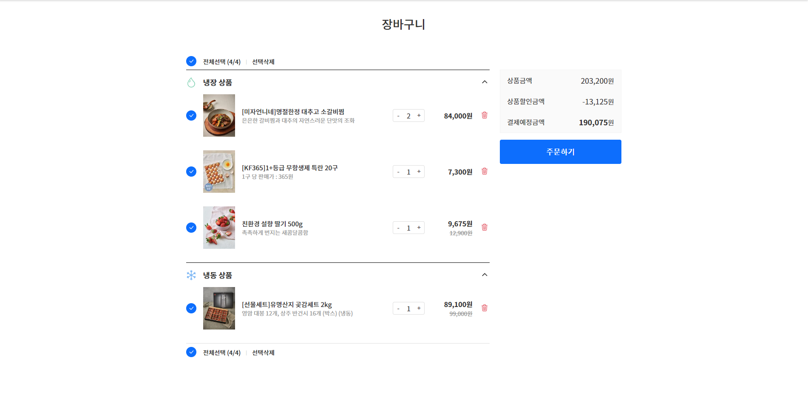

장바구니 기능은 비회원도 가능하며 비회원 상태에서 장바구니 담기 시 쿠키에 저장됩니다.
비회원 상태에서 회원으로 로그인 시 비회원 상태의 장바구니 목록이 로그인한 회원 장바구니에 저장됩니다.

1. [`장바구니 페이지`](https://github.com/jeonoseung/shop/blob/main/pages/cart/index.tsx)
2. [`UI 구성`](https://github.com/jeonoseung/shop/tree/main/src/component/cart)

    회원 비회원 으로 구성 전체적으로 비슷하나 
    회원,비회원,모바일별로 렌더링 해야했기때문에 파일을 나눴습니다.

## 카테고리 상품
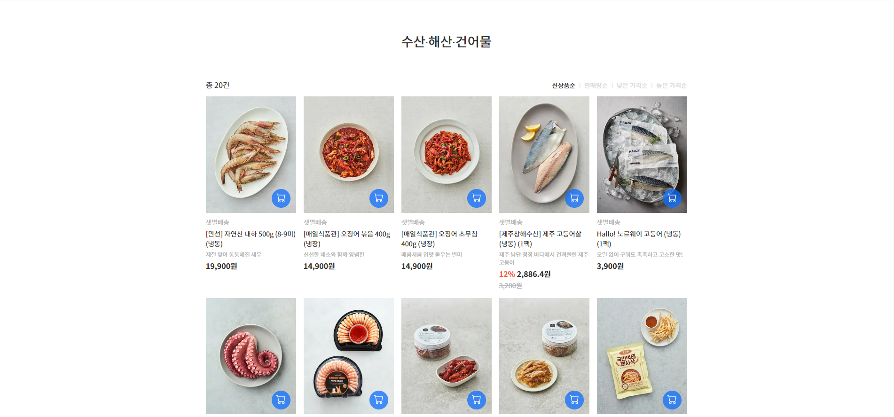

카테고리 목록에서 특정 카테고리를 선택하면 해당 카테고리의 상품 목록이 표시됩니다. 
신상품순, 판매량순, 낮은 가격 또는 높은 가격순으로 정렬할 수 있습니다.

1. [`카테고리 상품 페이지`](https://github.com/jeonoseung/shop/blob/main/pages/category/%5Bpid%5D.tsx)
2. [`UI 구성`](https://github.com/jeonoseung/shop/tree/main/src/component/public/list)

    목록,정렬 UI는 검색 페이지, 컬렉션 상품 목록 페이지에서도 
    사용하고 있기 때문에 공용 component에서 관리하고 있습니다.

## 컬렉션 상품
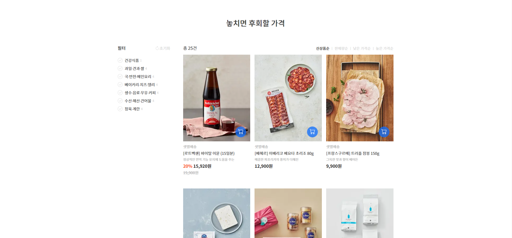

컬렉션에 해당하는 상품 목록을 확인할 수 있습니다. 카테고리 별로 필터를 적용 시킬수도 있고 정렬 또한 가능합니다.

1. [`컬렉션 상품 페이지`](https://github.com/jeonoseung/shop/blob/main/pages/collection/%5Brouter%5D.tsx)
2. [`UI 구성`](https://github.com/jeonoseung/shop/tree/main/src/component/public/list)

## 상품 정보
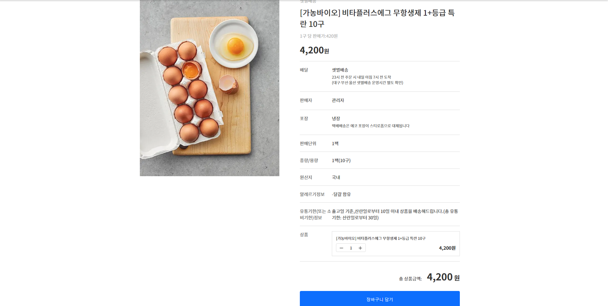

등록한 상품의 정보를 확인할 수 있고 장바구니 담기를 하거나, 상품 후기 확인을 할 수 있습니다.

1. [`상품 정보 페이지`](https://github.com/jeonoseung/shop/blob/main/pages/product/%5Bpid%5D.tsx)
2. [`UI 구성`](https://github.com/jeonoseung/shop/tree/main/src/component/product/product-info)

    
    해당 UI는 모바일별 UI을 따로 구현하지 않고 classname 변경을 통해 반응형 방식으로 구현했습니다.

## 주문 내역
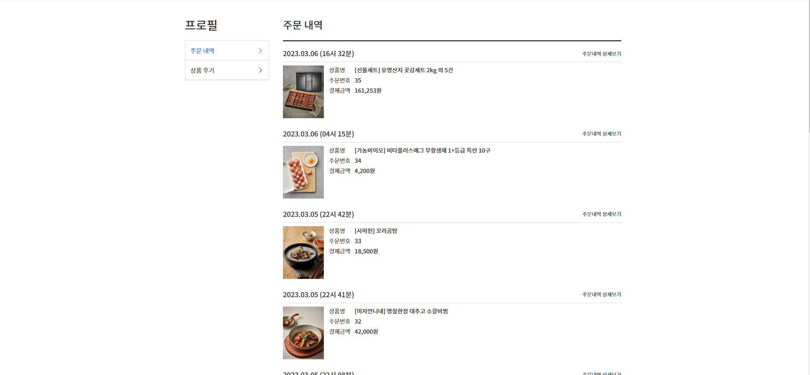

주문 내역 또는 주문 내역 상세보기를 할 수 있습니다.

1. [`상품 주문 내역 페이지`](https://github.com/jeonoseung/shop/tree/main/pages/my-page/order)
2. [`UI 구성`](https://github.com/jeonoseung/shop/tree/main/src/component/my-page/order)

    
    모바일 화면에서 width가 좁다면 부자연스럽게 보이기 때문에 분기별 렌더링으로 구현했습니다

## 상품 후기
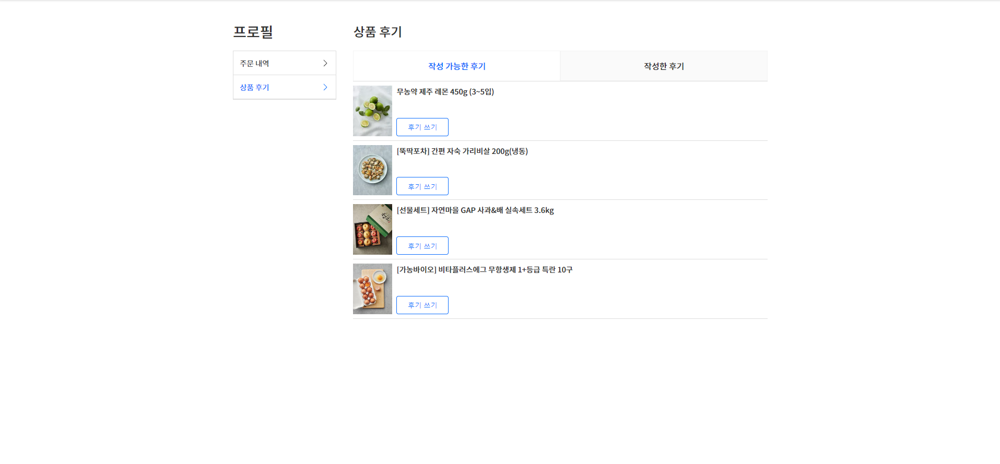

작성 가능한 상품 후기를 확인,작성하거나 작성한 후기를 확인할 수 있습니다.

1. [`상품 후기 페이지`](https://github.com/jeonoseung/shop/blob/main/pages/my-page/review/index.tsx)
2. [`UI 구성`](https://github.com/jeonoseung/shop/tree/main/src/component/my-page/review)

## 상품 관리
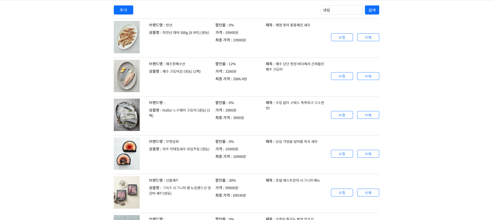

상품 리스트 표시 
특정 상품을 검색하거나 추가,수정 선택 가능한 페이지

1. [`상품 관리 목록 페이지`](https://github.com/jeonoseung/shop/blob/main/pages/admin/product/list.tsx)
2. [`UI 구성`](https://github.com/jeonoseung/shop/tree/main/src/component/product/admin/list)

    
    모바일 화면에서 width 좁다면 부자연스럽게 보이기 때문에 분기별 렌더링으로 구현했습니다

## 상품 관리 추가&수정
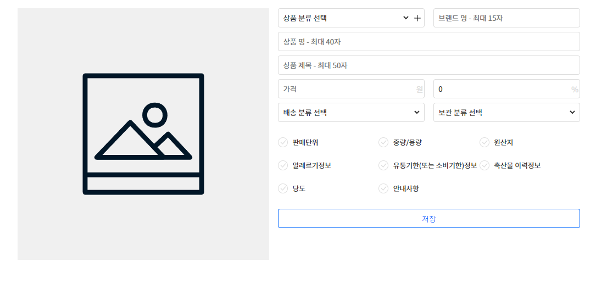

상품 추가,수정 가능한 페이지
상품 추가,수정 페이지에서 같은 component 사용했고
수정 페이지에서 useEffect를 사용해 전역 상태 값을 셋팅 해줬습니다.

1. [`상품 추가 페이지`](https://github.com/jeonoseung/shop/blob/main/pages/admin/product/add.tsx)
2. [`상품 수정 페이지`](https://github.com/jeonoseung/shop/blob/main/pages/admin/product/update/%5Bpid%5D.tsx)
3. [`UI 구성`](https://github.com/jeonoseung/shop/tree/main/src/component/product/admin/add)

    
    데이터만 셋팅 해주고 저장 이벤트만 변경해줘서 같은 component를 사용했습니다

## 컬렉션 관리
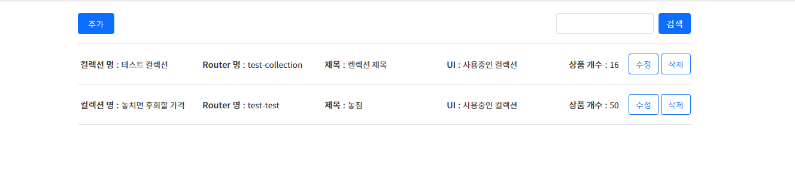

UI나 특정 주제 상품 모음에 사용할 컬렉션 관리 페이지
컬렉션 명, router명 제목 표시와 메인 홈 UI에서 해당 컬렉션을 사용중 유무와
등록되어 있는 상품 개수 표시됩니다.

1. [`컬렉션 관리 목록 페이지`](https://github.com/jeonoseung/shop/blob/main/pages/admin/collection/list.tsx)
2. [`UI 구성`](https://github.com/jeonoseung/shop/tree/main/src/component/collection/admin/list)
    

    모바일 화면에서 width 좁다면 부자연스럽게 보이기 때문에 분기별 렌더링으로 구현했습니다

## 컬렉션 관리 추가&수정
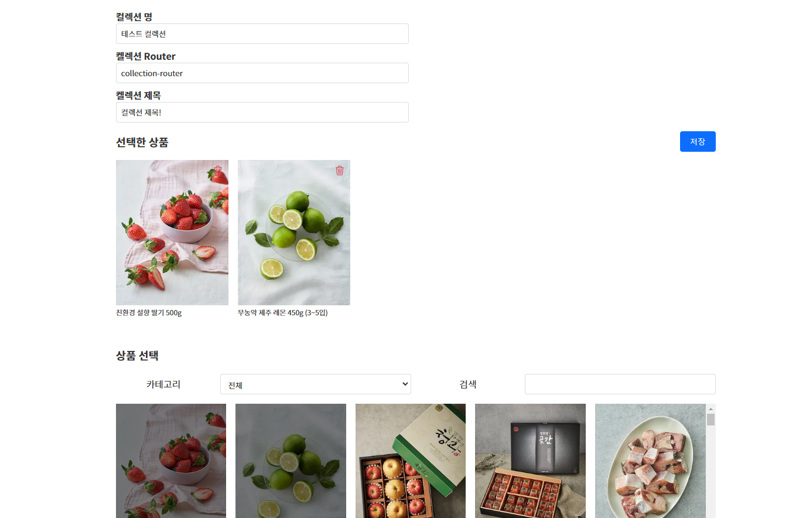

컬렉션 추가,수정 가능한 페이지
상품 관리와 같이 컬렉션 추가,수정 페이지에서도 같은 component 사용했고
수정 페이지에서 useEffect를 사용해 전역 상태 값을 셋팅 해줬습니다

1. [`컬렉션 추가 페이지`](https://github.com/jeonoseung/shop/blob/main/pages/admin/collection/add.tsx)
2. [`컬렉션 수정 페이지`](https://github.com/jeonoseung/shop/blob/main/pages/admin/collection/update/%5Bpid%5D.tsx)
3. [`UI 구성`](https://github.com/jeonoseung/shop/tree/main/src/component/collection/admin/add)

    
    상품 관리와 같이 전역 상태 값 셋팅, 이벤트만 변경해줘서 같은 component를 사용했습니다

## 메인 홈 UI 관리
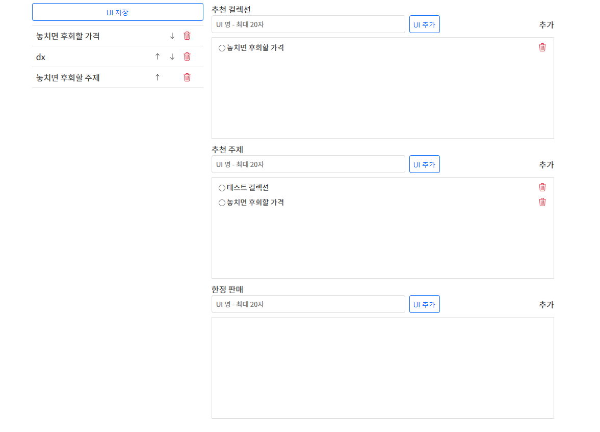

메인 홈페이지의 UI(추천 컬렉션,추천 주제, 한정 판매)를 추가,삭제할 수 있는 페이지

좌측 리스트에서 드래그 드롭이나 화살표를 눌러 순서 변경, 모바일에서는 드래그 드롭 작동X

UI명 입력은 사용자 화면에 표시되는 기능이 아닌 관리 목록에서 식별 가능하게 하는 메모 기능

우측의 UI별 추가에서 UI 양식을 추가하고 UI 추가에서 선택 후 UI명 입력 후 추가

마지막으로 추가나 순서 변경 시 UI 저장 버튼을 눌러 저장이 필요합니다.

한정 판매 UI의 경우 설정한 끝 시간이 되면 해당 UI는 삭제되고
설정한 할인률 또한 원래 할인률로 초기화됩니다.

1. [`UI 관리 페이지`](https://github.com/jeonoseung/shop/blob/main/pages/admin/form/index.tsx)
2. [`UI 관리`](https://github.com/jeonoseung/shop/blob/main/src/component/form/admin/ui-form-list.tsx)

    
    UI 순서 변경 또는 삭제 관리 component

3. [`추천 컬렉션 관리 UI 구성`](https://github.com/jeonoseung/shop/tree/main/src/component/form/admin/collection)

    추천 컬렉션 관리 component
    UI에 추가하거나 양식을 추가할 수 있습니다.

4. [`추천 주제 관리 UI 구성`](https://github.com/jeonoseung/shop/tree/main/src/component/form/admin/topic)

    추천 주제 관리 component
    UI에 추가하거나 양식을 추가할 수 있습니다.
    이미지를 추가하고 내용을 입력할 수 있습니다.

5. [`한정 판매 관리 UI 구성`](https://github.com/jeonoseung/shop/tree/main/src/component/form/admin/limited)

    한정 판매 관리 component
    UI에 추가하거나 양식을 추가할 수 있습니다.
    한정 판매 상품은 하나의 양식에 한하여 3개까지 등록 가능하고
    시작 시간과 종료 시간을 설정할 수 있습니다.
    시작 시간은 이전시간으로 설정할 수 없으며 
    한정 판매 양식 생성 후 UI에 등록하면 시작 시간이 되기 전까지 메인 홈UI에 나타나지 않습니다.
    설정한 종료 시간이 되면 UI목록에서 제거되고 양식 또한 삭제됩니다.
    그리고 설정한 할인률은 원래 할인률로 초기화 됩니다.

## 로그인
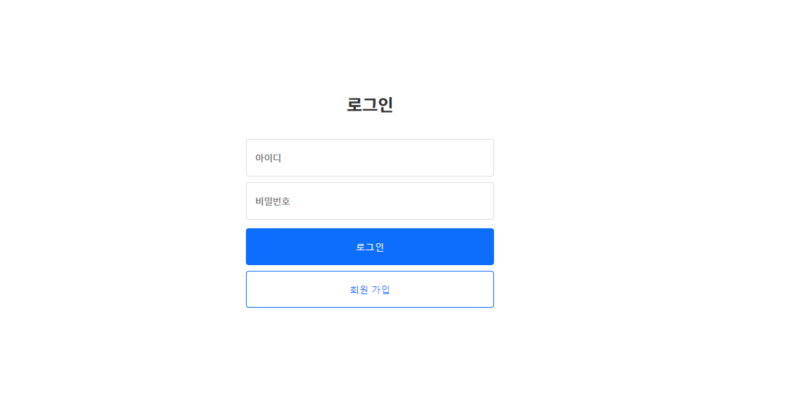

1. [`로그인 페이지`](https://github.com/jeonoseung/shop/blob/main/pages/member/login.tsx)
2. [`UI 구성`](https://github.com/jeonoseung/shop/blob/main/src/component/member/login.tsx)
    

    구성이 적어 하나의 component로 관리
    다른 UI에서 분기별로(모바일 상태에서 비회원일시) 렌더링하여 사용하기 위해 component로 관리했습니다

## 회원가입
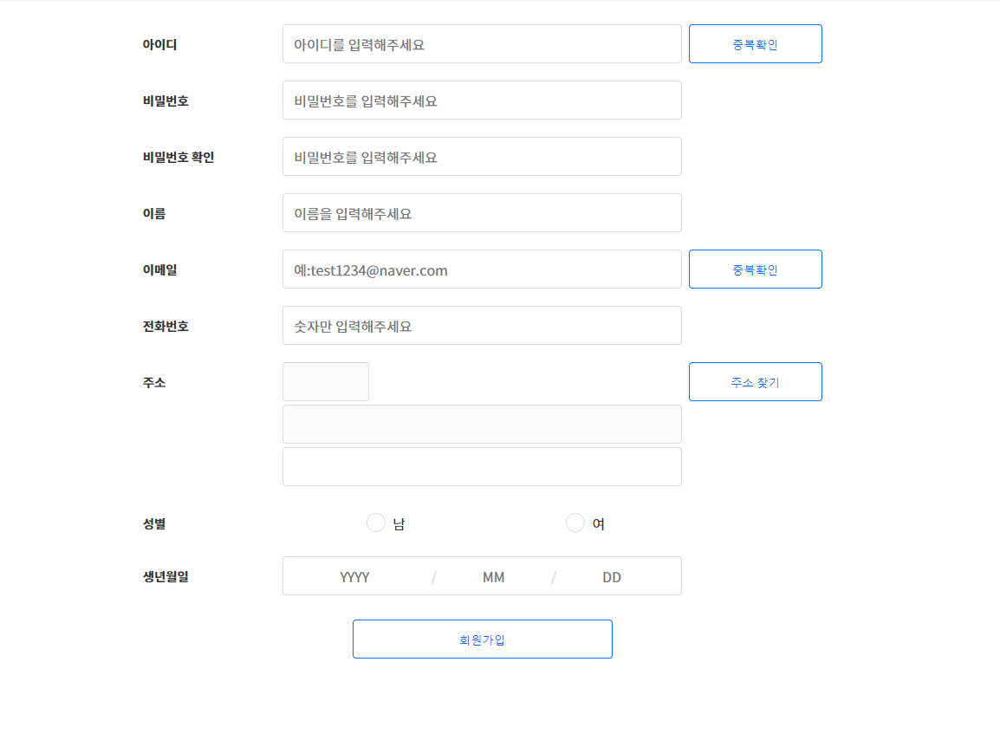

1. [`회원가입 페이지`](https://github.com/jeonoseung/shop/blob/main/pages/member/signup.tsx)
2. [`UI 구성`](https://github.com/jeonoseung/shop/tree/main/src/component/member/SignUp)

    입력란 마다 기능이 많기 때문에 전부 component로 나눴습니다